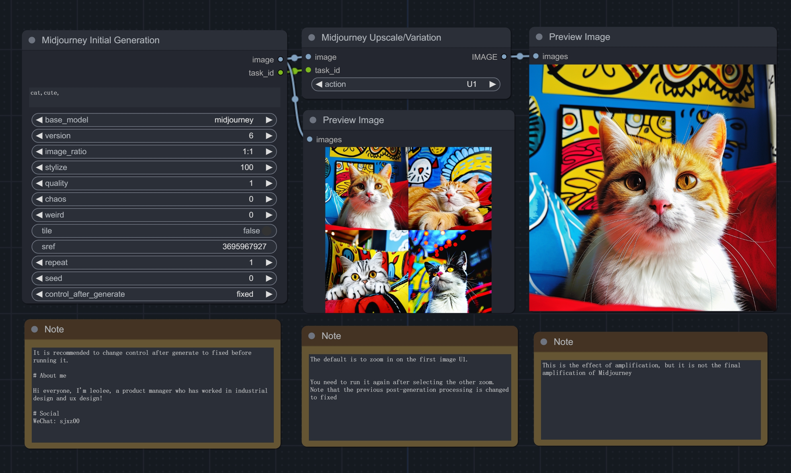
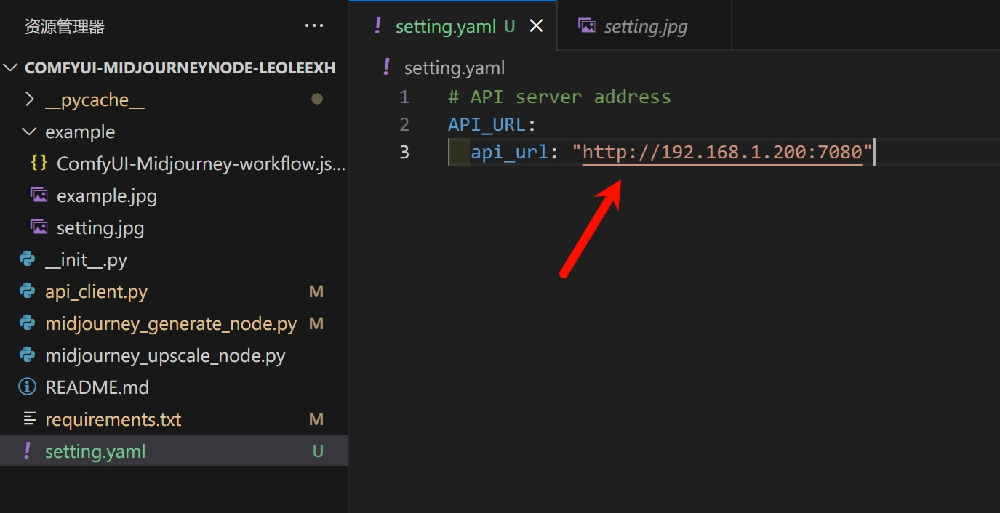

# Update
2024-08-01: Add a new feature: Add v 6.1 model selection; change configuration url method; add q2 parameter.

# ComfyUI-MidjourneyNode-leoleexh
This node allows ComfyUI to easily integrate with Midjourney, utilizing the ultra-high quality of Midjourney and the powerful control of SD to provide more convenient capabilities for AIGC.

## note

This node relies on the `midjourney proxy project` and requires API deployment in advance. For detailed installation, please refer to the instructions of the project.
https://github.com/novicezk/midjourney-proxy
  
## Installation
Git clone this repo into the `custom_nodes` folder.
If necessary, check the pip requirements. It will be necessary.

## Settings

In the `setting.yaml` file, just set the API address.

### Reference code

Based on the secondary development of the following project, As a designer, writing code is not easy. If it's helpful, you can contribute together or add a star!

https://github.com/novicezk/midjourney-proxy

## License
GPL 3.